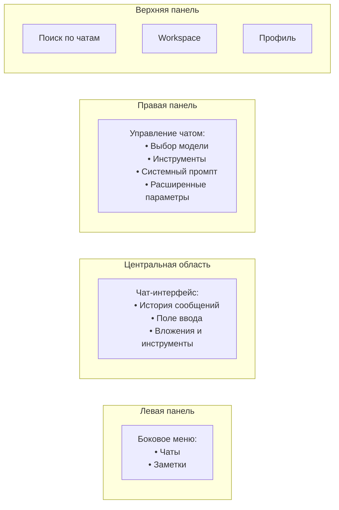

# Руководство пользователя

## Платформа «БелВЭБ Ai»

**Версия документа:** 1.1

**Дата составления:** 2026-06-19

---

## Лист регистрации изменений

| Версия | Дата | Автор | Описание изменений |
|--------|------|-------|-------------------|
| 1.0 | 2026-06-18 | Команда разработки | Первоначальная версия документа |
| 1.1 | 2026-06-19 | Команда разработки | Реструктуризация по функциональным блокам, добавление панели управления диалогом, уточнение локальных моделей |

---

## Содержание

1. [Введение](#1-введение)
2. [Термины и сокращения](#2-термины-и-сокращения)
3. [Начало работы](#3-начало-работы)
   - 3.1 Авторизация в системе
   - 3.2 Интерфейс — обзор
   - 3.3 Выбор модели
4. [Прикрепление файлов](#4-прикрепление-файлов)
   - 4.1 Поддерживаемые форматы
   - 4.2 Прикрепление веб-страниц по ссылке
   - 4.3 Прикрепление файлов большого размера
   - 4.4 Использование ранее загруженных файлов
   - 4.5 Инструмент захвата области экрана
5. [Чат с языковыми моделями](#5-чат-с-языковыми-моделями)
   - 5.1 Отправка сообщений и форматирование
   - 5.2 Переключение моделей
   - 5.3 Добавление дополнительной модели (сравнение)
   - 5.4 WebSocket и потоковая передача
   - 5.5 Ветвление и восстановление истории
6. [Панель управления диалогом](#6-панель-управления-диалогом)
   - 6.1 Обзор
   - 6.2 Инструменты
   - 6.3 Системный промпт
   - 6.4 Расширенные параметры
   - 6.5 Вентили (Valves)
7. [Инструменты](#7-инструменты)
   - 7.1 Интеграция интерпретатора кода
   - 7.2 Веб-поиск
   - 7.3 Память (Memory)
   - 7.4 Сводка доступных инструментов
8. [Работа с чатами](#8-работа-с-чатами)
   - 8.1 Режим временного чата
   - 8.2 Публикация чата (Поделиться ссылкой)
   - 8.3 Экспорт истории чата (Загрузить чат)
   - 8.4 Клонирование чата
   - 8.5 Переименование чата
   - 8.6 Удаление чата
   - 8.7 Поиск по списку чатов
9. [Организация чатов](#9-организация-чатов)
   - 9.1 Создание папки
   - 9.2 Редактирование и настройка папки
   - 9.3 Перемещение чата в папку
   - 9.4 Закрепление чата
   - 9.5 Архивирование диалогов
   - 9.6 Теги
10. [Базы знаний и RAG](#10-базы-знаний-и-rag)
    - 10.1 Что такое RAG
    - 10.2 Подключение баз знаний
    - 10.3 Создание базы знаний
    - 10.4 Использование базы знаний в чате
    - 10.5 Поиск и вопросы по документам
11. [Генерация презентаций](#11-генерация-презентаций)
    - 11.1 Включение генерации
    - 11.2 Типы слайдов
    - 11.3 Формат запроса
    - 11.4 Скачивание и просмотр
    - 11.5 Рекомендации по составлению запросов
12. [Подготовка справочных чатов (Workspace)](#12-подготовка-справочных-чатов-workspace)
    - 12.1 Создание справочного чата (Модели)
    - 12.2 Промпты
    - 12.3 Инструменты (Tools)
    - 12.4 Навыки (Skills)
    - 12.5 Функции (Functions)
13. [Заметки](#13-заметки)
    - 13.1 Создание заметок вручную
    - 13.2 Создание заметок силами ассистента
    - 13.3 Прикрепление сохраненных заметок
14. [Управление контекстом диалога](#14-управление-контекстом-диалога)
    - 14.1 Объем диалоговой сессии
    - 14.2 Контекстное окно и его ограничения
    - 14.3 Фильтры контекста
15. [Настройки и персонализация](#15-настройки-и-персонализация)
16. [Часто задаваемые вопросы](#16-часто-задаваемые-вопросы)

---

## 1. Введение

Настоящий документ является руководством пользователя для платформы **«БелВЭБ Ai»** — корпоративной версии открытой платформы Open WebUI, адаптированной для нужд ОАО «БелВЭБ Банк».

Платформа предоставляет единый веб-интерфейс для работы с большими языковыми моделями (LLM). Пользователи могут вести диалоги с моделями, загружать документы для анализа, создавать презентации, управлять базами знаний и использовать инструменты ИИ — всё в одном окне браузера.

**Основные возможности:**

- **Чат** — общение с моделями в реальном времени, сравнение ответов нескольких моделей
- **RAG (поиск по документам)** — загрузка документов, создание баз знаний, семантический поиск
- **Генерация презентаций** — создание PPTX-файлов через чат
- **Инструменты** — веб-поиск, исполнение кода, память
- **Workspace** — управление моделями, промптами, инструментами и навыками
- **Заметки** — создание и редактирование контента с помощью ИИ

Документ предназначен для конечных пользователей платформы.

---

## 2. Термины и сокращения

| Термин / Сокращение | Описание |
|---------------------|----------|
| **LLM** | Large Language Model — большая языковая модель |
| **RAG** | Retrieval-Augmented Generation — генерация ответов с извлечением контекста из документов |
| **Модель** | Языковая модель, с которой ведётся диалог |
| **Промпт** | Текстовый запрос пользователя или системная инструкция для модели |
| **Системный промпт** | Инструкция, задающая поведение модели на весь диалог |
| **Эмбеддинг** | Векторное представление текста, используемое для семантического поиска |
| **База знаний (KB)** | Коллекция документов, по которым модель может искать информацию |
| **Инструмент (Tool)** | Расширение, дающее модели дополнительные возможности (поиск, код, память) |
| **Функция (Function)** | Программный модуль, модифицирующий запросы/ответы (фильтры, пайпы) |
| **Навык (Skill)** | Набор инструкций для модели, определяющий подход к задачам |
| **Workspace** | Раздел для управления моделями, промптами, инструментами и навыками |
| **Контекстное окно** | Максимальный объём текста, который модель может обработать за один запрос |
| **PPTX** | Формат файлов Microsoft PowerPoint |
| **Вентиль (Valve)** | Конфигурируемый параметр модели/инструмента |

---

## 3. Начало работы

### 3.1 Авторизация в системе

Для доступа к платформе перейдите по URL-адресу, предоставленному администратором.

При первом посещении откроется страница входа. Нажмите **«Создать учётную запись»**, чтобы зарегистрироваться:

1. Укажите имя, email и пароль
2. Подтвердите пароль (если включено администратором)
3. Нажмите **«Зарегистрироваться»**

**Внимание:** Первый зарегистрированный пользователь автоматически получает права администратора. Все последующие регистрации требуют подтверждения администратором (статус «Ожидание»).

После регистрации войдите, указав email и пароль. При включённой поддержке SSO/OAuth можно использовать корпоративную учётную запись.

### 3.2 Интерфейс — обзор

Основные элементы интерфейса:



| Элемент | Описание |
|---------|----------|
| **Боковое меню (левая панель)** | Навигация: список чатов, заметки, папки |
| **Центральная область** | Область чата: сообщения, поле ввода |
| **Правая панель** | Управление текущим чатом: модель, инструменты, системный промпт, расширенные параметры |
| **Верхняя панель** | Поиск, Workspace, профиль |
| **Кнопка «+»** у поля ввода | Меню инструментов и действий |

### 3.3 Выбор модели

На платформе доступны две локальные модели:

**gpt-oss 120b** — текстовая модель большого объёма.
- Подходит для: анализа документов, генерации текстов, кода, презентаций
- Не обрабатывает изображения
- Контекстное окно: [уточнить у администратора]

**qwen3vl** — мультимодальная модель.
- Подходит для: задач, требующих понимания изображений (схемы, скриншоты, графики, подписи к картинкам)
- Также работает с текстом
- Контекстное окно: [уточнить у администратора]

Выбор модели осуществляется в правой панели чата:

1. Откройте правую панель (кнопка в правом верхнем углу области чата)
2. В выпадающем списке выберите нужную модель
3. Переключаться можно в любой момент — даже в середине диалога

**Совет:** Если нужно проанализировать изображение — выберите qwen3vl. Для длинных текстов и презентаций — gpt-oss 120b.

---

## 4. Прикрепление файлов

### 4.1 Поддерживаемые форматы

К сообщению можно прикрепить файлы следующих форматов:

**Документы:**
- PPTX (презентации PowerPoint)
- PDF (документы)
- DOC / DOCX (документы Word)
- XML (структурированные документы)

**Изображения:**
- PNG
- JPG / JPEG

Примечание: мультимодальная модель (qwen3vl) может анализировать прикреплённые изображения — распознаёт текст на фото, описывает схемы и графики. Текстовая модель (gpt-oss 120b) изображения не обрабатывает.

**Таблицы и данные:**
- XLS / XLSX (таблицы Excel)
- CSV (табличные данные)

Для прикрепления файла:

1. Нажмите кнопку **скрепка** или перетащите файл в поле ввода
2. Дождитесь загрузки (индикатор прогресса)
3. При необходимости введите дополнительный текст
4. Отправьте сообщение

Модель получит содержимое файла вместе с вашим сообщением и сможет ответить, опираясь на его содержание.

### 4.2 Прикрепление веб-страниц по ссылке

Для анализа содержимого веб-страницы:

1. В поле ввода чата вставьте URL-адрес страницы
2. Модель загрузит и проанализирует её содержимое
3. Задайте вопрос по содержанию страницы

### 4.3 Прикрепление файлов большого размера

При загрузке объёмных документов учитывайте:

- Файлы свыше примерно 20 000 токенов не обрабатываются целиком — модель видит только начальную часть
- Для работы с большими документами создайте базу знаний (см. раздел 10)
- При необходимости разделите файл на части по 10–15 страниц

### 4.4 Использование ранее загруженных файлов

Ранее загруженные файлы сохраняются в истории платформы. Чтобы повторно использовать файл:

1. Нажмите кнопку **скрепка** в поле ввода
2. Просмотрите список загруженных ранее файлов
3. Выберите нужный — он будет прикреплён к текущему сообщению

### 4.5 Инструмент захвата области экрана

Платформа позволяет быстро прикрепить снимок экрана:

1. Нажмите кнопку **скрепка** в поле ввода
2. Выберите **Захват области экрана** (Screenshot)
3. Выделите нужную область
4. Снимок будет прикреплён к сообщению

Скриншот может быть обработан мультимодальной моделью (qwen3vl).

---

## 5. Чат с языковыми моделями

### 5.1 Отправка сообщений и форматирование

1. Введите текст в поле ввода
2. Нажмите **Enter** или кнопку отправки (стрелка вправо)
3. Модель начнёт генерировать ответ в потоковом режиме

**Сочетания клавиш:**

| Сочетание | Действие |
|-----------|----------|
| `Enter` | Отправить сообщение |
| `Shift + Enter` | Новая строка в сообщении |

**Форматирование:** Поле ввода поддерживает Markdown и подсветку синтаксиса для кода:

- `**жирный текст**`
- `*курсив*`
- Блоки кода: ```` ```язык … ``` ````
- Списки: `- пункт` или `1. пункт`
- Заголовки: `# Заголовок`

Модели отвечают в формате Markdown, включая таблицы, код и формулы.

**Очередь сообщений:** Вы можете начать вводить следующее сообщение, пока модель генерирует ответ на предыдущее. Сообщения отправятся автоматически после завершения текущего ответа.

**Остановка генерации:** нажмите кнопку **«Остановить»** (квадрат) во время генерации, чтобы прервать ответ модели.

**Регенерация:** нажмите кнопку **«↻»** на сообщении модели, чтобы запросить новый ответ на тот же промпт.

### 5.2 Переключение моделей

Модель можно сменить в любой момент — даже в середине диалога:

1. Откройте правую панель
2. В выпадающем списке моделей выберите другую модель (gpt-oss 120b или qwen3vl)
3. Продолжите диалог — выбранная модель будет использоваться для следующих ответов

### 5.3 Добавление дополнительной модели (сравнение ответов)

Для параллельного сравнения ответов нескольких моделей:

1. Нажмите кнопку **«+»** рядом с селектором модели
2. Выберите одну или несколько дополнительных моделей
3. Отправьте сообщение — ответы всех выбранных моделей отобразятся рядом

Удобно для сравнения качества ответов разных моделей на один и тот же запрос.

### 5.4 WebSocket и потоковая передача

Ответы моделей передаются через WebSocket, что обеспечивает:

- Потоковую генерацию (токен за токеном)
- Мгновенное отображение текста без ожидания полного ответа
- Стабильное соединение даже при долгих генерациях

### 5.5 Ветвление и восстановление истории

Каждый чат поддерживает историю сообщений с возможностью:

- **Ветвления:** отредактируйте или регенерируйте любое сообщение — создастся ветка, сохраняющая все варианты
- **Навигации по веткам:** с помощью стрелок у сообщений модели
- **Удаления сообщений:** удалите сообщение — все последующие ответы модели останутся

---

## 6. Панель управления диалогом

Правая панель (открывается кнопкой в правом верхнем углу чата) содержит настройки, управляющие поведением модели в текущем диалоге.

### 6.1 Обзор

Вкладка **Обзор** показывает сводную информацию о чате: выбранную модель, активные инструменты, подключённые базы знаний.

### 6.2 Инструменты

Включение и выключение инструментов для текущего чата:

- **Веб-поиск** — поиск информации в интернете
- **Code Interpreter** — исполнение Python-кода
- **Память (Memory)** — запоминание фактов о пользователе
- **Презентация** — генерация PPTX-файлов

Подробное описание инструментов — в разделе 7.

### 6.3 Системный промпт

Системный промпт — инструкция, которая определяет поведение модели. Задаётся в правой панели:

1. В поле **«Введите системный промпт»** напишите инструкцию
2. Модель будет следовать этой инструкции во всех ответах текущего диалога

**Пример:** «Ты — консультант кредитного отдела. Отвечай кратко и по существу. Если не знаешь ответа — скажи об этом.»

Системный промпт, заданный в панели управления, **переопределяет** общий промпт модели на время диалога.

### 6.4 Расширенные параметры

Вкладка **Расширенные параметры** позволяет точно настроить генерацию ответов:

| Параметр | По умолчанию | Описание |
|----------|-------------|----------|
| **Потоковый вывод ответа** | Вкл | Токен за токеном (в реальном времени) или полный ответ сразу |
| **Размер чанка дельты потока** | Стандартный | Размер фрагмента текста при потоковой передаче |
| **Вызов функции (Function Calling)** | Default | Режим вызова инструментов: Native (рекомендуется) или Default |
| **Теги рассуждения** | Стандартные | Показывать/скрывать цепочку мыслей модели (`think` / `thinking`) |
| **Начальное значение (Seed)** | Случайное | Фиксация генератора случайных чисел для воспроизводимых ответов |
| **Последовательность останова** | — | Текст, при появлении которого модель немедленно прекращает генерацию |
| **Температура** | Стандартная | Степень случайности ответа: 0 — строго детерминированный, 2 — максимально креативный |
| **Усилия для рассуждения (Reasoning Effort)** | Medium | Low / Medium / High — глубина обдумывания перед ответом |
| **logit_bias** | — | Смещение вероятности конкретных токенов (продвинутая настройка) |
| **max_tokens** | Стандартное | Максимальная длина генерируемого ответа (в токенах) |
| **top_k** | Стандартное | Ограничение выборки: чем меньше, тем предсказуемее ответ |

**Как пользоваться:**
- **Температура:** Для точных ответов (факты, цифры) ставьте ближе к 0. Для творческих задач (идеи, тексты) — 0.7–1.2
- **max_tokens:** Ограничьте, если модель даёт слишком длинные ответы
- **top_k:** Уменьшите до 20–40 для более сфокусированных ответов
- **Seed:** Зафиксируйте значение для повторяемых результатов (полезно при тестировании)

Параметры влияют только на текущий диалог и сбрасываются при создании нового чата.

### 6.5 Вентили (Valves)

Вентили — параметры настройки инструментов и функций. Каждый инструмент может иметь свой набор вентилей (например, число результатов поиска, таймаут выполнения кода). Настраиваются администратором в разделе **Workspace → Tools**.

---

## 7. Инструменты

Инструменты (Tools) — расширения, дающие модели дополнительные возможности. Модель сама решает, когда вызвать инструмент, в зависимости от запроса.

Включение инструментов для текущего чата: меню **«+»** у поля ввода или правая панель → **Инструменты**.

### 7.1 Интеграция интерпретатора кода

Модель может писать и исполнять код на Python прямо в чате.

**Как использовать:**
1. Включите **Code Interpreter** в меню инструментов
2. Попросите модель выполнить вычисление или анализ: «Посчитай сумму первых 100 простых чисел»
3. Модель напишет код, выполнит его и покажет результат

**Окружение:** Pyodide — Python в браузере, без доступа к файловой системе сервера.

### 7.2 Веб-поиск

Модель может искать информацию в интернете и использовать результаты для составления ответа.

**Как использовать:**
1. В меню инструментов включите **Веб-поиск**
2. Задайте вопрос, требующий актуальной информации
3. Модель выполнит поиск и ответит, ссылаясь на найденные источники

Доступные поисковые системы настраиваются администратором.

### 7.3 Память (Memory)

Память позволяет модели запоминать факты о пользователе между разными чатами.

**Как использовать:**
1. В меню инструментов включите **Memory**
2. В ходе диалога сообщите модели информацию о себе
3. Модель сохранит факты и будет использовать в будущих диалогах

Факты из памяти извлекаются автоматически, когда это релевантно текущему запросу.

### 7.4 Сводка доступных инструментов

| Инструмент | Что делает | Где включить |
|-----------|------------|--------------|
| **Веб-поиск** | Поиск актуальной информации в интернете | Кнопка + или правая панель |
| **Code Interpreter** | Исполнение Python-кода в чате | Кнопка + или правая панель |
| **Память (Memory)** | Запоминание фактов о пользователе | Кнопка + или правая панель |
| **Презентация** | Генерация PPTX-файлов | Кнопка + или правая панель |

Модель вызывает инструменты автоматически. Пользователю не нужно указывать, какой именно инструмент использовать — достаточно описать задачу.

---

## 8. Работа с чатами

### 8.1 Режим временного чата

Временный чат (Temporary Chat) — диалог, который не сохраняется в истории.

**Как использовать:**
1. В правой панели или меню чата включите **Режим временного чата**
2. Отправьте сообщение — после закрытия чата история будет удалена

Удобно для разовых запросов, не засоряющих список чатов.

### 8.2 Публикация чата (Поделиться ссылкой)

1. Откройте контекстное меню чата (значок «...» рядом с названием)
2. Выберите **Поделиться ссылкой**
3. Скопируйте ссылку и отправьте коллеге — получатель увидит историю чата в режиме чтения

### 8.3 Экспорт истории чата (Загрузить чат)

1. В контекстном меню чата выберите **Загрузить чат** (Export)
2. Выберите формат экспорта
3. Файл с историей будет скачан на компьютер

### 8.4 Клонирование чата

Создание точной копии чата для эксперимента без риска испортить оригинал:

1. В контекстном меню чата выберите **Клонировать**
2. Будет создана копия со всей историей сообщений
3. В копии можно продолжать диалог независимо от оригинала

### 8.5 Переименование чата

1. Щёлкните по названию чата в боковом меню
2. Введите новое название
3. Нажмите Enter

При включённой функции авто-генерации названий модель предложит название автоматически.

### 8.6 Удаление чата

1. В контекстном меню чата выберите **Удалить**
2. Подтвердите удаление

**Внимание:** удалённые чаты не подлежат восстановлению.

### 8.7 Поиск по списку чатов

Строка поиска в верхней части бокового меню позволяет быстро найти нужный чат по названию или тегу. Введите ключевые слова — список отфильтруется мгновенно.

---

## 9. Организация чатов

### 9.1 Создание папки

Для группировки чатов по темам:

1. В боковом меню нажмите **«+»** рядом с разделом «Чаты»
2. Выберите **«Создать папку»**
3. Укажите название папки (например: «Кредитный отдел», «Отчётность», «Проекты»)

Папки можно раскрывать/сворачивать, перетаскивать чаты между папками.

### 9.2 Редактирование и настройка папки

1. Нажмите значок «...» рядом с названием папки
2. Доступные действия:
   - **Переименовать** — изменить название папки
   - **Удалить** — удалить папку (чаты внутри не удаляются, а перемещаются в корень)

### 9.3 Перемещение чата в папку

1. Перетащите чат мышью в нужную папку в боковом меню
2. Или: контекстное меню чата → **Переместить** → выбрать папку

### 9.4 Закрепление чата

Закреплённые чаты отображаются вверху списка. Удобно для часто используемых диалогов.

1. Наведите курсор на чат в боковом меню
2. Нажмите значок **булавки** (Pin)
3. Для открепления — нажмите булавку ещё раз

### 9.5 Архивирование диалогов

Архивные чаты скрываются из основного списка, но не удаляются:

1. Контекстное меню чата → **Архивировать**
2. Для просмотра архивных чатов: в боковом меню переключитесь на вкладку «Архив»
3. Для разархивирования: контекстное меню → **Восстановить из архива**

### 9.6 Теги

Чатам можно присваивать теги для облегчения поиска и группировки:

- Модель может автоматически генерировать теги на основе содержимого чата (если включено администратором)
- Теги отображаются под названием чата
- Поиск по тегам — через строку поиска в боковом меню

---

## 10. Базы знаний и RAG

### 10.1 Что такое RAG

RAG (Retrieval-Augmented Generation) — технология, позволяющая модели искать информацию в ваших документах без загрузки их целиком в контекст. Документы разбиваются на фрагменты, для каждого создаётся векторное представление (эмбеддинг). При запросе система находит наиболее релевантные фрагменты и передаёт их модели.

Это позволяет задавать вопросы по документам произвольного размера.

### 10.2 Подключение баз знаний

Подключение базы знаний к чату:

**Способ 1 — через кнопку «#»:**
1. В поле ввода нажмите кнопку **«#»**
2. Выберите нужную базу знаний из списка
3. Отправьте сообщение — модель получит доступ к документам базы

**Способ 2 — привязка к модели:**
1. Перейдите в **Workspace → Models**
2. Выберите модель и в настройках привяжите базу знаний
3. База знаний будет автоматически доступна при каждом использовании этой модели

Для каждой базы знаний можно настроить права доступа (какие пользователи или группы могут её использовать).

### 10.3 Создание базы знаний

1. Перейдите в **Workspace → Knowledge**
2. Нажмите **«Создать базу знаний»**
3. Укажите название и описание
4. Загрузите документы через кнопку **«+»**
5. Дождитесь завершения индексации (прогресс-бар)

Поддерживаемые форматы документов: PDF, DOCX, PPTX, XLSX, TXT, CSV, JSON, Markdown, HTML, изображения (с распознаванием текста).

Параметры индексации (настраиваются администратором):
- `CHUNK_SIZE` — размер фрагмента (по умолчанию 5000 символов)
- `RAG_TOP_K` — количество извлекаемых фрагментов (по умолчанию 50)
- `RAG_FULL_CONTEXT_MAX_CHARS` — максимальный объём контекста (100 000 символов)

### 10.4 Использование базы знаний в чате

При активной базе знаний действия модели:
1. Получает запрос пользователя
2. Выполняет семантический поиск по документам
3. Извлекает наиболее релевантные фрагменты
4. Формирует ответ на основе найденной информации

### 10.5 Поиск и вопросы по документам

**Примеры запросов:**
- «Какая процентная ставка по кредиту указана в документе?»
- «Сравни условия ипотеки из трёх последних загруженных приказов»
- «Какие сроки рассмотрения заявки описаны в регламенте?»

**Совет:** Чем конкретнее вопрос, тем точнее будет ответ. Избегайте размытых формулировок.

---

## 11. Генерация презентаций

Платформа «БелВЭБ Ai» поддерживает автоматическую генерацию презентаций в формате PPTX (Microsoft PowerPoint). Модель формирует слайды на основе вашего запроса, а платформа создаёт готовый файл для скачивания.

### 11.1 Включение генерации

Генерация презентаций включена по умолчанию на уровне платформы. В чате нажмите кнопку **«+»** у поля ввода и убедитесь, что переключатель **«Презентация»** активен.

### 11.2 Типы слайдов

Модель поддерживает семь типов слайдов:

| Тип | Назначение | Поля |
|-----|-----------|------|
| `title` | Титульный слайд | `title`, `subtitle` |
| `bullets` | Основной контент — заголовок + маркированный список | `title`, `items: [...]` |
| `two_column` | Сравнение, два текста рядом | `title`, `left`, `right` |
| `image_text` | Слайд с изображением и подписью | `title`, `image_file_id`, `image_caption` |
| `section` | Разделитель, крупный текст по центру | `title`, `subtitle` |
| `table` | Таблица с данными | `title`, `header: [...]`, `rows: [[...]]` |
| `thank_you` | Завершающий слайд | `title` (по умолчанию «СПАСИБО!») |

### 11.3 Формат запроса

Для генерации презентации опишите её содержание в чате. Модель сама выберет типы слайдов и наполнит их содержимым.

**Примеры запросов:**

```
Создай презентацию на тему «Итоги работы отдела за I квартал». Включи титульный слайд,
обзор ключевых показателей (3-4 пункта), сравнительный анализ план/факт и завершающий слайд.

---

Подготовь презентацию для совещания: повестка, три вопроса на обсуждение,
решения по каждому вопросу, итоги.

---

Сделай презентацию про новый кредитный продукт: название, условия, преимущества (5 пунктов),
сравнение с текущими продуктами (таблица), контакты для обращений.
```

Модель генерирует ответ, содержащий JSON-структуру слайдов внутри маркера `<!--GENERATE_FILE:...-->`. Платформа автоматически создаёт PPTX-файл и встраивает ссылку для скачивания.

### 11.4 Скачивание и просмотр

После генерации в сообщении модели появится:

1. **Ссылка для скачивания** — кнопка с именем файла (формат `.pptx`)
2. **Превью слайдов** (при наличии) — встроенный просмотрщик в интерфейсе чата

Нажмите на имя файла для скачивания. Файл также сохраняется в истории чата и доступен для повторного скачивания.

### 11.5 Рекомендации по составлению запросов

- **Указывайте тему** презентации
- **Описывайте структуру** — какие разделы или вопросы должны быть освещены
- **Задавайте количество слайдов** — «сделай 7-10 слайдов»
- **Уточняйте тип данных** — «добавь таблицу с показателями» или «сделай сравнение в две колонки»
- **Прикрепляйте материалы** — загрузите документ, по которому нужна презентация
- **Прикрепляйте изображения** — их можно использовать в слайдах типа `image_text`

**Важно:** Не используйте шаблонные фразы вроде «СЛАЙД 1», «НАЗВАНИЕ», «ПЕРЕБИВОЧНЫЙ СЛАЙД» — модель обучена создавать содержательные слайды на основе смысла вашего запроса.

---

## 12. Подготовка справочных чатов (Workspace)

Workspace — раздел для создания предварительно настроенных «справочных чатов»: моделей с фиксированным системным промптом, привязанными документами (базами знаний) и инструментами.

### 12.1 Создание справочного чата (Модели)

В разделе **Workspace → Models** создайте пользовательскую модель — это и есть справочный чат. Настройте:

- **Базовую модель** — gpt-oss 120b или qwen3vl
- **Системный промпт** — задаёт поведение модели
- **Базы знаний** — прикрепите документы
- **Инструменты** — веб-поиск, код, память
- **Параметры генерации** — temperature, max_tokens

**Пример справочного чата «Кредитный консультант»:**
- Базовая модель: gpt-oss 120b
- Системный промпт: «Ты — эксперт по кредитным продуктам банка. Отвечай на основе приложенных регламентов. Не давай советов вне документов.»
- Привязанная база знаний: «Регламенты кредитного отдела»
- Инструменты: веб-поиск (для курсов валют)

**Динамические переменные:** В системных промптах можно использовать переменные:
- `{{ USER_NAME }}` — имя пользователя
- `{{ CURRENT_DATE }}` — текущая дата
- `{{ CURRENT_TIME }}` — текущее время

Созданные справочные чаты доступны в селекторе моделей. Настраивается доступ: можно открыть для всех пользователей или ограничить группами.

**Ветвление:** Внутри справочного чата можно создавать ветки диалога (см. раздел 5.5), не теряя основную конфигурацию чата.

### 12.2 Промпты

Промпты — сохранённые шаблоны запросов для быстрого использования:

1. Перейдите в **Workspace → Prompts**
2. Нажмите **«Создать промпт»**
3. Укажите название, описание и текст шаблона
4. (Опционально) Добавьте переменные ввода

Созданные промпты доступны в чате через кнопку **«/»** (слэш) у поля ввода.

### 12.3 Инструменты (Tools)

В разделе **Workspace → Tools** можно создавать и управлять пользовательскими инструментами — Python-скриптами, расширяющими возможности модели.

**Создание инструмента:**
1. Нажмите **«Создать инструмент»**
2. Укажите название, описание и код на Python
3. (Опционально) Настройте параметры (Valves) — конфигурируемые переменные

### 12.4 Навыки (Skills)

Навыки — наборы Markdown-инструкций, которые учат модель определённым подходам к задачам:

1. Перейдите в **Workspace → Skills**
2. Создайте навык с инструкциями
3. Используйте в чате, ссылаясь на навык через тег `$skillId|label`

### 12.5 Функции (Functions)

Функции — программные модули трёх типов:

| Тип | Где срабатывает | Пример |
|-----|----------------|--------|
| **Filter** | При каждом запросе и/или ответе | Обрезка контекста, подсчёт токенов |
| **Pipe** | Как модель в селекторе | Маршрутизация запросов |
| **Action** | По нажатию кнопки под сообщением | «Перевести ответ», «Сохранить в Knowledge» |

Функции настраиваются администратором. Пользователь может включать/отключать доступные функции в настройках чата.

---

## 13. Заметки

Заметки — личное рабочее пространство для создания и редактирования контента с поддержкой ИИ.

### 13.1 Создание заметок вручную

1. Перейдите в **Notes** (левая панель)
2. Нажмите **«Новая заметка»**
3. Введите название и содержимое (Rich Text / Markdown редактор)

### 13.2 Создание заметок силами ассистента

Модель может создавать заметки по вашему запросу:

1. В чате напишите: «Создай заметку с итогами нашего обсуждения»
2. Модель сформулирует и сохранит заметку
3. Заметка появится в разделе Notes

**AI Enhance:** Внутри заметки выделите фрагмент текста и нажмите **«AI Enhance»** — модель перепишет текст: улучшит стиль, исправит ошибки, переформулирует.

### 13.3 Прикрепление сохраненных заметок

Заметку можно прикрепить к чату для передачи модели в качестве контекста:

1. В поле ввода нажмите кнопку **«#»** или **скрепку**
2. Выберите нужную заметку
3. Модель получит полное содержимое заметки (а не фрагментированные чанки)

---

## 14. Управление контекстом диалога

### 14.1 Объем диалоговой сессии

Каждый диалог имеет ограничение по количеству обрабатываемой информации:

- В контекст входит: системный промпт, вся история диалога, прикреплённые файлы, результаты инструментов и новое сообщение
- Чем длиннее диалог, тем ближе к исчерпанию контекстного окна
- При достижении лимита модель возвращает ошибку (см. 14.2)

**Рекомендация:** Для продолжительных обсуждений периодически начинайте новый чат, резюмируя ключевые выводы предыдущего.

### 14.2 Контекстное окно и его ограничения

Каждая модель имеет ограничение на объём обрабатываемого текста — **контекстное окно**.

**Контекстные окна моделей:**
- gpt-oss 120b: [уточнить у администратора]
- qwen3vl: [уточнить у администратора]

Когда общий объём превышает лимит модели, платформа возвращает ошибку:

> The prompt is too long: <общее_число>, model maximum context length: <лимит>

**Крупные файлы:** Документы объёмом свыше примерно 20 000 токенов не обрабатываются целиком — модель видит только начальную часть. Для больших документов используйте базы знаний (RAG) — они разбивают документ на фрагменты и извлекают только релевантные.

**Что делать при ошибке:**
1. **Начните новый чат** — перенесите суть вопроса без накопившейся истории
2. **Удалите старые сообщения** — особенно те, где были большие файлы
3. **Уменьшите размер файла** — разделите документ на части по 10–15 страниц
4. **Используйте базу знаний** вместо прямого прикрепления файла (см. раздел 10)

### 14.3 Фильтры контекста

Фильтры автоматически обрезают историю, чтобы она умещалась в контекстное окно. Фильтры устанавливаются администратором через функции (Functions → Filters). Стратегии обрезки:

- **По сообщениям** — оставить N последних сообщений
- **По токенам** — обрезать, когда суммарное количество токенов превышает порог
- **Суммаризация** — автоматически сокращать старые сообщения

Обратитесь к администратору для настройки фильтра, если вы часто сталкиваетесь с ошибкой контекстного окна.

---

## 15. Настройки и персонализация

Персональные настройки доступны через иконку профиля в верхней панели → **Settings**:

| Раздел | Настройки |
|--------|----------|
| **General** | Язык интерфейса, тема (светлая/тёмная), уведомления |
| **Chat** | Настройки чата по умолчанию: модель, инструменты, параметры |
| **Interface** | Настройки отображения: размер шрифта, ширина чата, автозаполнение |
| **Account** | Смена пароля, API-ключи, удаление аккаунта |

**Тема интерфейса:**
- Светлая (Light)
- Тёмная (Dark)
- Автоматическая (следует за системной темой)

---

## 16. Часто задаваемые вопросы

### Регистрация и доступ

**В: Не могу зарегистрироваться — кнопка регистрации отсутствует.**
О: Регистрация отключена администратором. Обратитесь к администратору для создания учётной записи.

**В: Зарегистрировался, но не могу войти — «Ожидание подтверждения».**
О: Ваша учётная запись ожидает подтверждения администратором. Обратитесь к администратору платформы.

**В: Забыл пароль. Как восстановить?**
О: Воспользуйтесь ссылкой «Забыли пароль?» на странице входа. Если функция недоступна — обратитесь к администратору.

### Чат и модели

**В: Модель отвечает медленно. Что делать?**
О: Возможные причины:
- Модель большая и требует много ресурсов
- Высокая нагрузка на сервер (попробуйте позже)
- Длинная история диалога (начните новый чат)

**В: Как сравнить ответы двух моделей?**
О: Нажмите кнопку «+» рядом с селектором модели и выберите дополнительные модели (см. раздел 5.3).

**В: Можно ли сменить модель в середине чата?**
О: Да. Модель можно сменить в любой момент через селектор в правой панели (см. раздел 5.2).

**В: Почему модель «забыла» начало разговора?**
О: Превышено контекстное окно модели. Начните новый чат или обратитесь к администратору для настройки фильтра контекста (см. раздел 14).

### Документы и базы знаний

**В: Почему модель неправильно отвечает по документу?**
О: Возможные причины:
- Документ не полностью проиндексирован (дождитесь завершения индексации)
- Документ содержит сложное форматирование (таблицы, сканы)
- Вопрос слишком общий — сформулируйте конкретнее

**В: Можно ли загрузить отсканированный документ?**
О: Да, если настроено OCR-распознавание. Уточните у администратора.

**В: Как удалить документ из базы знаний?**
О: Перейдите в **Workspace → Knowledge**, выберите базу, нажмите значок корзины у документа.

### Презентации

**В: Как получить качественную презентацию?**
О: Опишите тему максимально конкретно. Укажите количество слайдов, разделы, тип данных. Избегайте шаблонных фраз.

**В: Модель сгенерировала текст, но файл не создался.**
О: Убедитесь, что переключатель «Презентация» активен. Если проблема повторяется — обратитесь к администратору.

**В: Можно ли редактировать готовую презентацию?**
О: Презентация скачивается в формате PPTX. Отредактируйте её в PowerPoint или аналоге.

### Параметры диалога

**В: Как сделать ответы модели более точными?**
О: В панели управления диалогом (см. раздел 6) уменьшите температуру до 0.1–0.3 и, при необходимости, top_k до 20–40.

**В: Как сделать ответы модели более творческими?**
О: Увеличьте температуру до 0.8–1.2. Для максимальной вариативности — до 1.5.

**В: Модель отвечает слишком длинно. Как сократить?**
О: В расширенных параметрах уменьшите значение max_tokens (например, до 500–1000).

### Безопасность и данные

**В: Кто видит мои чаты?**
О: По умолчанию чаты видны только вам и администратору (если включён admin chat access). Другие пользователи не имеют доступа к вашим чатам.

**В: Где хранятся мои данные?**
О: Все данные хранятся на сервере платформы. Данные не передаются внешним сервисам, если это не требуется для работы (например, запрос к внешней модели через API).

---

*Конец документа*

**Контактная информация:**
По всем вопросам использования платформы обращайтесь к администратору:
- Email: [указать email администратора]
- Внутренний портал: [указать URL]
